- [intro](#i)
- [Part 1](#p1)
- [Part 2](#p2)
- [Part 3](#p3)
- [Part 4](#p4)

---
### From player representation to enactive presence {#i}
#### The case of 'boomer shooters'

<small><markdown>
Constantinos Miltiadis  
School of ARTS -- Aalto University  
constantinos.miltiades@aalto.fi  
[studioany.com](http://studioany.com)  
</markdown></small>

<small><markdown>
Nordic Explorative Workshops on the Philosophy of Games -- ITU Copenhagen 29/08/2023 
</markdown></small>



Videogames have blessed us with novel forms of storytelling and character representation --  matters that were discussed in length in the context of game studies. 

Here, I am concerned with a persistent and sizeable part of videogames that offer neither stories, nor player-character representations per se. Just action journeys. 
This is central to the gaming experience they evoke and thus central to their aesthetic qualities and aesthetic language. 

The problem with this category of games, is that they often evade analytical lenses due to difficulties of accounting for nothing but moment-to-moment action in virtual space.



---
#### Outline 

<li class = "fragment"> 'games of enaction'  </li>
<li class = "fragment"> the problem of analysis  </li>
<li class = "fragment"> the case of 'boomer shooters'  </li>
<li class = "fragment"> understanding through making  </li>


- Games that celebrate enaction 
- issues of analysis, as enactive and performative experience /tacit skills / difficult to transfer to text 
- boomer shooters - a phenomenon (2016)


--- 
#### 1. Enactivism {#p1}

<small>
<li class = "fragment"> cognition arises from the dynamic interrelations between an active organism and its surrounding environment </li>
<li class = "fragment"> cognition is an exercise of skilful know-how in situated and embodied action, modulated through sensorimotor couplings</li>

<li class = "fragment"> During gameplay: Player > interactive avatar (technological intentionality) situated in a virtual environment </li>

</small>



- Cognitive sciences; by Francisco Varela, Evan Thompson, and Eleanor Rosch in The Embodied Mind (1991). 
- Builds on phenomenology to suggest ... 
- [not only that perception occurs through the body, but cognition also] 
- Cognition is in the bidirectional relationship between the two   
- Moreover, Enactivism suggest a first-person perspective to the study of experience 
- And it's skillful / thus it can be 
- In games, a Player assumes a technological intentionality through an (interactive) avatar situated in a virtual environment / offset our sensorimotor capacities to those of the avatar / transfer our skills 



<bib>

- Varela, Francisco J., Evan Thompson, and Eleanor Rosch. _The Embodied Mind: Cognitive Science and Human Experience_. Revised edition. 1991. Reprint, Cambridge, Massachusetts ; London England: MIT Press, 2016.
- Fetzer, Frank. ‘The “I” as an “Other”. Technological Intentionality and the Avatar’. In _Action in Games_, 7. Krakow, 2017. [https://gamephilosophy2017.files.wordpress.com/2017/11/fetzer_pocg2017.pdf](https://gamephilosophy2017.files.wordpress.com/2017/11/fetzer_pocg2017.pdf).
- Vahlo, Jukka. ‘An Enactive Account of the Autonomy of Videogame Gameplay’. _Game Studies_ 17, no. 1 (July 2017). [https://gamestudies.org/1701/articles/vahlo](https://gamestudies.org/1701/articles/vahlo).
</bib>

---



<footer> 

Super Mario Bros 1985 (Nintendo). 
</footer>


- no explanation of the world, only by similitude
- here is a joystick, a screen with speakers, go.  
- Slowly as a player you understand how it jumps (or you jump), runs, etc.,  you develop a feeling for it
- Eventually, the whole objective of Mario, is get to the right-most position, by jumping and running


---
#### But wait... What about saving Princes Peach? 



Do we *really* care about Princes Peach?  
Or, is it just an inevitability of the game's representational narrative layer?

<!--
<li class = "fragment"> Do we *really* care about Princes Peach?  </li>
<li class = "fragment"> Or, is it just an inevitability of the game's representational narrative layer?</li>
-->




- saving Princess Peach is not the goal. It's an inevitability of the game's representational narrative framing. Not causal. 
- Nevertheless, it cannot explain the experience of the game / it's rather an overlay on top 



--- 

> Video games are a window onto a new kind of intimacy with machines [...] The holding power of video games, their almost hypnotic fascination, is computer holding power. The experiences of video game players help us to understand this holding power and something else as well. At the heart of the computer culture is the idea of constructed, “rulegoverned” worlds.


> There is nothing mindless about mastering a video game.... It’s more than thinking—in a way it is beyond thinking. The hand learns what to do and does it automatically, just as the hand “knows” after playing chord X on the piano to go directly and inexorably to chord Y.




Discussing Pac Man in 1984, Sherry Turkle discussed 


<bib>

- Turkle, Sherry. ‘Video Games and Computer Holding Power’. In _The New Media Reader_, edited by Noah Wardrip-Fruin and Nick Montfort, 499–513. 1984. Reprint, Cambridge, Mass.; London: MIT Press, 2003.
</bib>

--- 

#### 2. The problem with analysis {#p2}

> The Study of Games demonstrates that the narrow history of game research has mostly been sociological, anthropological, or philosophical, but not very well developed as an aesthetic field. That is, while much space has been devoted to the study of people (other than the researcher) playing games, **very little has been said about the first-person experience of playing a game**.

<bib>

-  Juul, Jesper. _Half-Real: Video Games Between Real Rules and Fictional Worlds_. 2005. Reprint, Cambridge, Mass: MIT Press, 2011.
</bib>


- engagement with cognitive skills in fields concerned with empirical research  


--- 

> Game studies methodologies which focus on the visual, narrative, and semiotic content of digital games overlook the way that embodied perception and physiological response contribute to the meaningfulness of games. Gameplay also needs to be understood in terms of affective response: the embodied, multisensory perception of the game environment.

<bib> 

- Shinkle, Eugenie. ‘Corporealis Ergo Sum: Affective Response in Digital Games’. In _Digital Gameplay: Essays on the Nexus of Game and Gamer_, edited by N. Garrelts, 21–35. North Carolina, USA: McFarland & Co, 2005.
- Shinkle, Eugénie. ‘Feel It, Don’t Think: The Significance of Affect in the Study of Digital Games’. In _Proceedings of the 2005 DiGRA International Conference: Changing Views: Worlds in Play_, 3:7. Vancouver, Canada, 2005.
</bib>


- Much of it has to do with the existing structures of scholarship -- and especially the textual medium, which has significant shortcomings in aspects of games research  
- we are all guilty of trying to make sense of rich audio-visual, procedural, interactive, and performative media (like videogames) in the most conventional and traditional of means. Simple text. 


--- 
##### Case study: The use of images in papers in the Game Studies Journal  


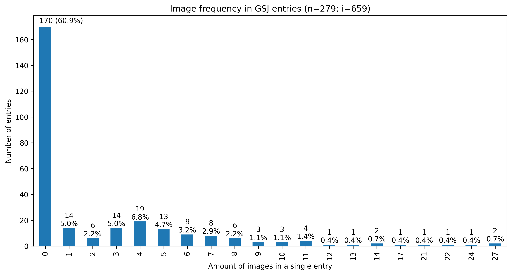


<bib>

- Miltiadis, Constantinos. ‘Other than Text: Media Used in Game Studies Publications. A Computational Analysis into 20 Years of Publications of the Game Studies Journal, and an Appeal for Research Through Design’. In _Proceedings of the 2023 DiGRA International Conference: Limits and Margins of Games_. Sevilla: DiGRA, 2023. [https://doi.org/10.5281/zenodo.7944673](https://doi.org/10.5281/zenodo.7944673).
</bib>


- Much of it has to do with the existing structures of scholarship -- and especially the textual medium, which has significant shortcomings in aspects of games research  
- we are all guilty of trying to make sense of rich audio-visual, procedural, interactive, and performative media (like videogames) in the most conventional and traditional of means. Simple text. 
- Graph shows the use of images in entries of the game studies journal 


---

#### Spatial turn in computer game studies?

> [Spatial simulation] is also a way to explore the partly unknown, to test models and hypotheses, and thus to construct and acquire new knowledge in a way narrative never could.  
> ... games celebrate and explore spatial representation as their central motif and raison d’être. (Aarseth 2000)



> The mediality of games can be derived from spatial configurations in the first instance, defining not only the edges of any possible game (as well as the act of gaming) but also transgressing what has, until now, been the border of game studies by overcoming the gap between narratological and ludological approaches. Thus, within the last few years, there has been a paradigmatic shift within computer games studies, which allows a focus on the games in their limits as interactive media. (Gunzel 2008)





> But we could also attempt to understand computer games as exemplifications of spatial concepts...
> Philosophical concepts of space, then, are not about a "true" or "false" representation of nature, but rather, they are the expression of culture. 
> Again, this is not a claim that the four-dimesional concept of space is "true," it only states that computer games can exemplify philosophical concepts--perhaps more accurately than any medium.


<bib>

- Aarseth, Espen. ‘Allegories of Space. The Question of Spatiality in Computer Games’. In _Cybertext Yearbook 2000_, edited by Raine Koskimaa and Markku Eskelinen, 44–47. Jyväskylä: University of Jyväskylä, 2001.
- Günzel, Stephan. ‘The Lived Space of Computer Games’. In _Architectonics of Game Spaces. The Spatial Logic of the Virtual and Its Meaning for the Real_, edited by Andri Gerber and Ulrich Götz, 167–81. Bielefeld, Germany: Transcript, 2019. [https://www.transcript-verlag.de/978-3-8376-4802-7/architectonics-of-game-spaces/](https://www.transcript-verlag.de/978-3-8376-4802-7/architectonics-of-game-spaces/).
- ———. ‘The Spatial Turn in Computer Game Studies’. In _Future and Reality of Gaming_, 147–56. Vienna: Braumüller, 2008.
</bib>

---
#### 3. 'Boomer shooters' {#p3}


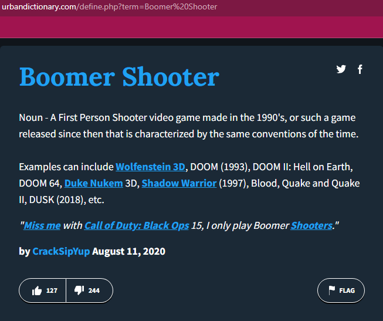




- Taking the most extreme and most intensive examples of virtual spatial experiences . That I know of. Which is the 'genre' of games called 'boomer shooters' or 'movement shooters'
- tongue in cheek term that emerged from online communities 
- Emerged after the release of Doom 2016
- to account for the surge of videogame releases resembling the style of 'old school' or 90s-style FP-Shooters  
- rather ignored by videogame research 
- Lively online communities/ with various commentators / 


---

#### 'Boomer/movement/retro shooters'

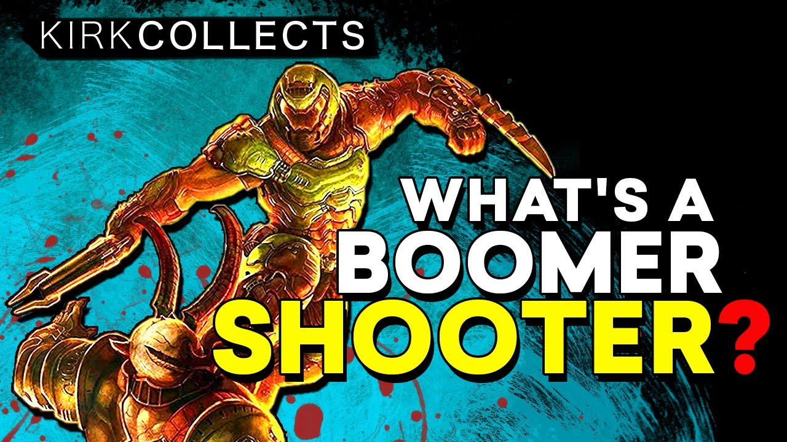
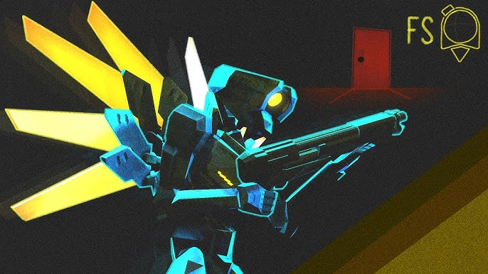
 

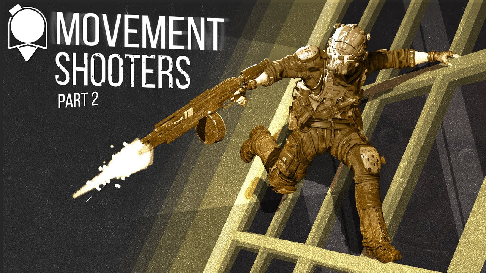

<bib>

- Kirk Collects. _What’s a Boomer Shooter? -  A Brief History of FPS Games_, 2020. [https://www.youtube.com/watch?v=dXCOKpJcYZU](https://www.youtube.com/watch?v=dXCOKpJcYZU).
- FUNKe. _The State of Movement Shooters_, 2019. [https://www.youtube.com/watch?v=c4vnKir5guQ](https://www.youtube.com/watch?v=c4vnKir5guQ).
- FUNKe. MORE Movement Shooters, 2021. https://www.youtube.com/watch?v=oRTh2aMgPY4.
- Garcia, Linden. ‘The Renaissance of the Original First Person Shooter: A Reflection’. Noobfeed, 30 November 2020. [https://www.noobfeed.com/features/1622/the-resurgence-of-the-boomer-shooter-a-brief-history-of-fps-games](https://www.noobfeed.com/features/1622/the-resurgence-of-the-boomer-shooter-a-brief-history-of-fps-games).
</bib>



- Taking the most extreme and most intensive examples of virtual spatial experiences . That I know of. Which is the 'genre' of games called 'boomer shooters' or 'movement shooters'
- tongue in cheek term that emerged from online communities 
- Emerged after the release of Doom 2016
- to account for the surge of videogame releases resembling the style of 'old school' or 90s-style FP-Shooters  
- rather ignored by videogame research 
- Lively online communities/ with various commentators / 


--- 

 'Canonical' FPS

- Wolfenstein (id Software 05.1992)
- Doom (id Software 12.1993) [modding, mapping, speedrunning]
- Virtual Cop (Sega 09.1994) 
- Descent (Parallax Software 03.1995) [6DoF]
- Quake (id Software 06.1996)  [full 3D]
- Team Fortress (mod 08.1996) [class-based]
- Golden Eye (Rare 08.1997) [console]
- Quake II (id Software 12.1997) 
- Unreal (Epic Games 05.1998) [expansive landscapes]
- Half-Life (Valve 11.1998) [narrative FPS]
- Quake III Arena (12.1999) [multiplayer only]
- Quake III CPMA (mod 08.2000) [competitive mod]
- DeFraG (mod 09.2000) [speedrunning/trickjumping] [World Cup 2017](https://www.youtube.com/watch?v=cCO9QuV-cgM&t=76s)
- Counter-Strike (Valve 11.2000) 
- Halo (*Bungie* 11.2001)
- Call of Duty (*Infinity Ward* 10.2003)


- boomer shooter was a celebration, a ressurgence 
- canonical games 
- Golden age  of shooters in the mid-to-late 1990s
- Forefront of Videogame technology development
- gave us multiple phenomena such as modding; mapping; speedrunning
- comes to a halt at about the 2000s / With the rise of consoles that essentially slowed down FPS because of their gamepad interface 


---

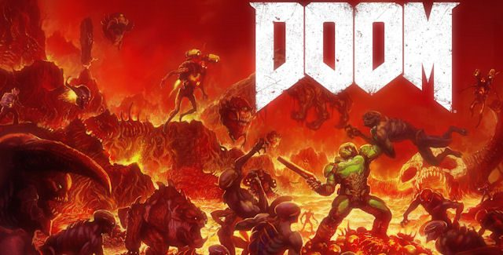


- surge of releases
- iterative advancements 






---

- Doom [2016] (*id Software* 05.2016) 
- Titanfall 2 (*Respawn Entertainment* 10.2016)
- DUSK (*David Szymanski* 12.2018)
- Doom Eternal (*id Software* 03.2020)
- Ultrakill (*Hakita* 09.2020)
- Boomerang X (*Dang!* 07.2021)
- Severed Steel (*Greylock Studio* 09.2021)
- Neon White (*Angel Matrix* 06.2022)
- Rollerdrome (*Roll7* 08.2022)
- Metal: Hellsinger (*The Outsiders* 09.2022)


- may or may not have clear refernces to past games (DUSK)
- or look old-school like Ultrakill (PS2)
- but all seem to bring about new systems and mechanics, that intend to intensify the experience 
- attitude to narrative varies 
- Realms deep - event on boomer shooters  / multiple commentators / doom tubers 


---

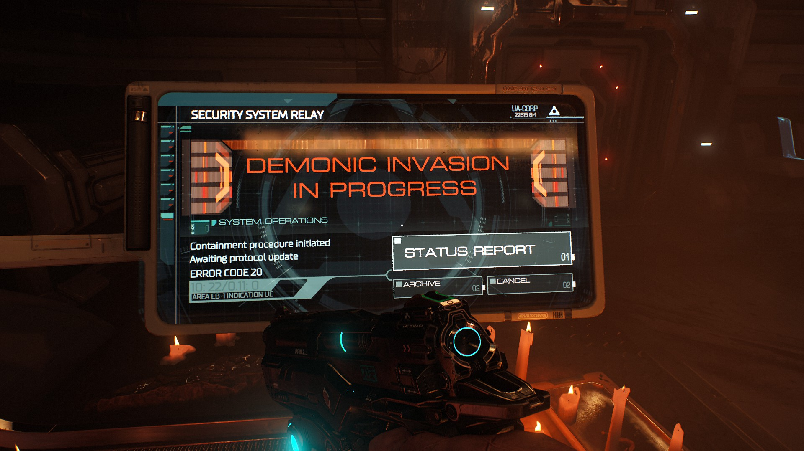

> With the phrase "Demonic invasion in progress" we are saying something to the audience. We are literally handing them a ticket for a train ride. 
> We are like are you ready to go? Cause we are gonna leave right now. 
> **Just forget it.** 
> **You know they are demons. we know they are demons. We both want to shoot them in the face. Let's just go.** (Hugo Martin 2016)

<bib>

- _DOOM Documentary: Part 2 - Designing a First Impression_, 2016. [https://www.youtube.com/watch?v=vsoVQWnSOfM](https://www.youtube.com/watch?v=vsoVQWnSOfM).
- Kifenstein. r/gaming "All you really need to know about the plot for Doom 2016."
</bib>


- embracing the ridiculous 
- Doom is an action game 
- made explicit by design


--- 




Breaking the screen
2:40


<!--

-->

---

> We want the player to know that we are respecting their intelligence. And we want them to know that we know that they are there to play a Doom game, and they are there to kill Demons. (Marty Stratton 2016)

<bib>

- _DOOM Documentary: Part 2 - Designing a First Impression_, 2016. [https://www.youtube.com/watch?v=vsoVQWnSOfM](https://www.youtube.com/watch?v=vsoVQWnSOfM). 
</bib>

---
#### The Doom Dance 




- iterate on how to intensify the experience furhter / by visual and sound cues 
- improvement of the enemy AI 


--- 
<!--
Narrative representation is inevitable 

Narrative as utility: narrative injections for pacing 

White Neon (pacing)

-->

#### 4. Understanding by making {#p4}


- Design as a 'mode of reasoning that produces the new' 
- New materials require practical exploration 


 
<bib>

- Schmid, Anne-Françoise. ‘The Philosophical Underpinnings of Design Theory’. In _Advancements in the Philosophy of Design_, edited by Pieter E. Vermaas and Stéphane Vial, 415–30. Design Research Foundations. Cham: Springer International Publishing, 2018. [https://doi.org/10.1007/978-3-319-73302-9_19](https://doi.org/10.1007/978-3-319-73302-9_19).
- Schmid, Anne-Françoise, and Armand Hatchuel. ‘On Generic Epistemology’. Translated by Robin Mackay. _Angelaki_ 19, no. 2 (3 April 2014): 131–44. [https://doi.org/10.1080/0969725X.2014.950868](https://doi.org/10.1080/0969725X.2014.950868).
- Schmid, Anne-Françoise. ‘On Contemporary Objects’. In _Simulation, Exercise, Operations_, translated by Robin Mackay, 63–68. Falmouth, United Kingdom: Urbanomic, 2015. [https://primer.dk/onsite/Projects/Ripe/Anne-Francoise-Schmid-On-Contemporary-Objects-2012](https://primer.dk/onsite/Projects/Ripe/Anne-Francoise-Schmid-On-Contemporary-Objects-2012).
</bib>


- Various contemporary projects and methodologies which include the creation of objects including HCI etc. 
- Here I take the 'generic epistemology' of Schmid. 
- Design as a mode of reasoning for the new - 
- Schmid suggests Generic epistemology as 'a paradigm shift without crisis'- concerned with post-discplinary 'integrative' objects (superimposition of fragments of different disciplines), and contemporary materials, which require active experimentation to investigate their potentials 


---

#### Virtual cosmogony 


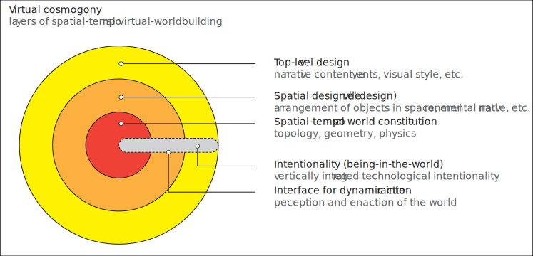


---
#### Intensive assemblages 



> An individual organism will typically exhibit a variety of capabilities to form assemblages with other individuals, organic or inorganic. A good example is the assemblage which **a walking** animal forms with **a piece of solid ground** (which supplies it with a surface to walk) and with **a gravitational field** (which endows it with a given weight). Although the capacity to form an assemblage depends in part on the emergent properties of the interacting individuals (animal, ground, field) it is nevertheless not reducible to them. We may have exhaustive knowledge about an individual’s properties and yet, not having observed it in interaction with other individuals, know nothing about its capacities...  
> An assembly process may be said to be characterized by intensive properties when it articulates heterogeneous elements [...In this example] three heterogeneous individuals are joined together as such without the need for any homogenization.




moving entity + patch of ground + gravitational field 

<bib> 

- DeLanda, Manuel. _Intensive Science and Virtual Philosophy_. 66-67. London ; New York: Bloomsbury Academic, 2013.
</bib>


- Environmental assemblage 
- merging of 3 heterogeneous elements into an intensive assemblage
- emergent capacities 


---

#### Environmental assemblage

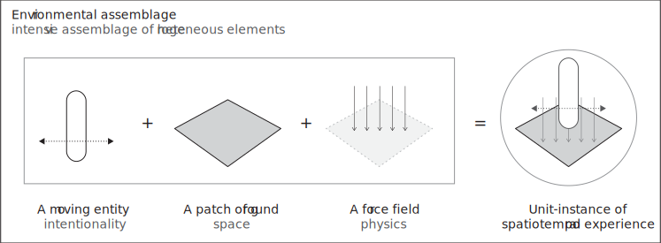 


- follow this a s a model, with all 3 elements open to modulation


--- 
 

> To this day, great conventionalisation dominates the design of game spaces even in Virtual Reality. Digital game worlds still customarily foreground similarities to real life architecture, movement, and social behaviour.

<bib> 

- Backe, Hans-Joachim. ‘The Aesthetics of Non-Euclidean Game Spaces’. In _Game | World | Architectonics: Transdisciplinary Approaches on Structures and Mechanics, Levels and Spaces, Aesthetics and Perception_, edited by Marc Bonner, 153–67. Heidelberg: Heidelberg University Publishing, 2021. [https://doi.org/10.17885/heiup.752](https://doi.org/10.17885/heiup.752).
</bib>

---
#### The problem with game development tools 



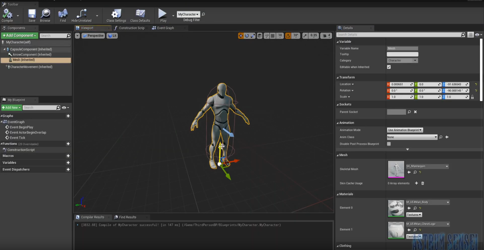


 
<small>
Game engines are essentially Cartesian model spaces with Newtonian physics 
</small>


<bib>

- Chesher, Chris. ‘Colonizing Virtual Reality. Construction of the Discourse of Virtual Reality, 1984-1992’. _Cultronix_ 1, no. 1 (1994).
- Gunkel, David J., and Ann Hetzel Gunkel. ‘Virtual Geographies: The New Worlds of Cyberspace’. _Critical Studies in Media Communication_ 14, no. 2 (1997): 123–37.
</bib>

---

#### Modular ground & physics

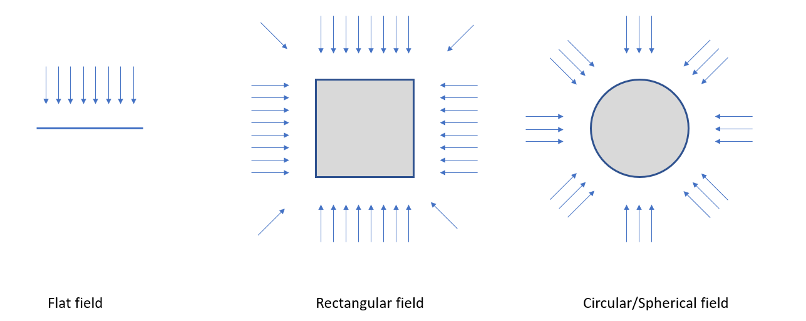

--- 

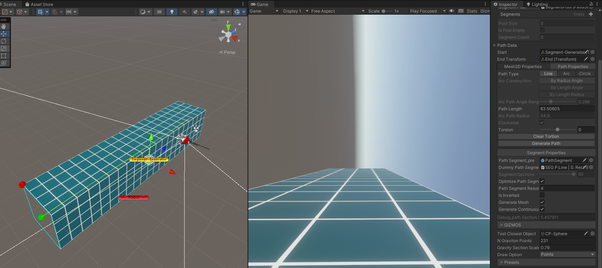

---

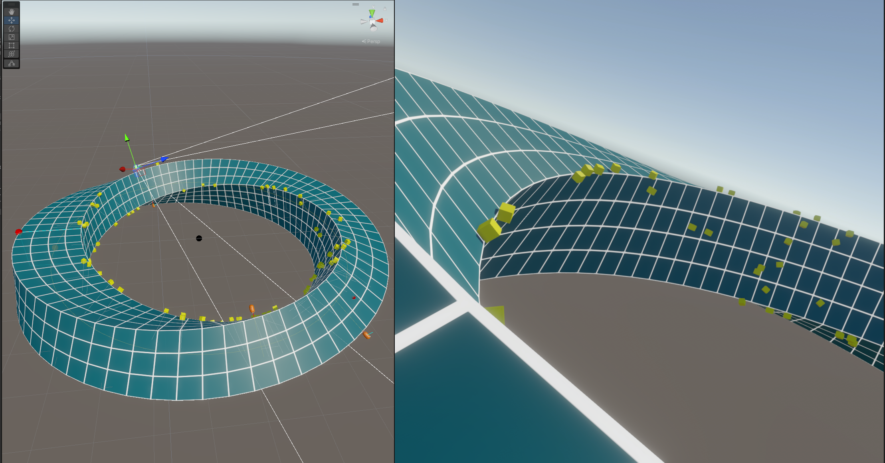 

--- 

#### Modular intentionality 

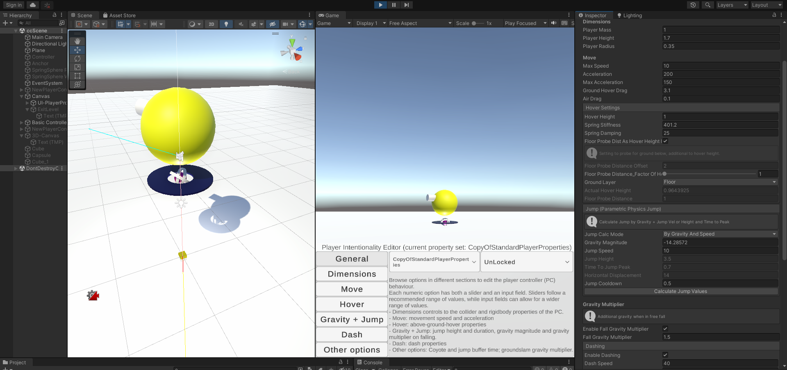

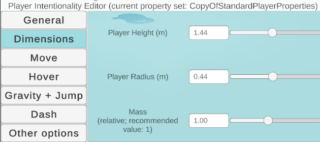

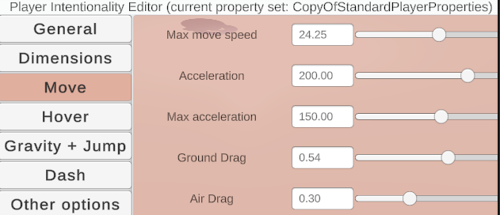

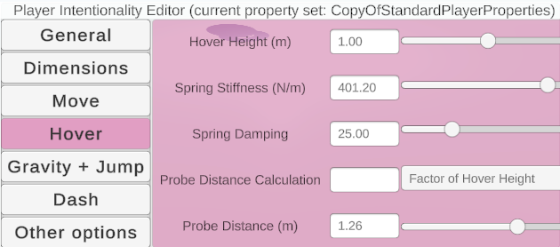
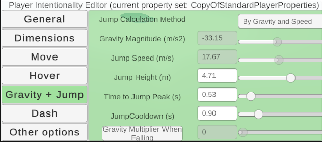

--- 

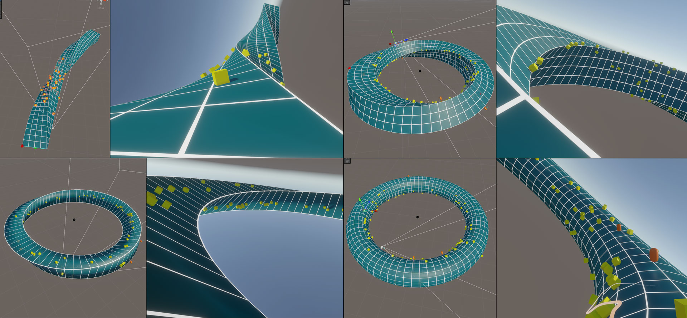

---

##### From player representation to enactive presence
###### The case of 'boomer shooters' {#i}

<small><markdown>
Constantinos Miltiadis  
School of ARTS -- Aalto University  
constantinos.miltiades@aalto.fi  
[studioany.com](http://studioany.com)  
</markdown></small>
